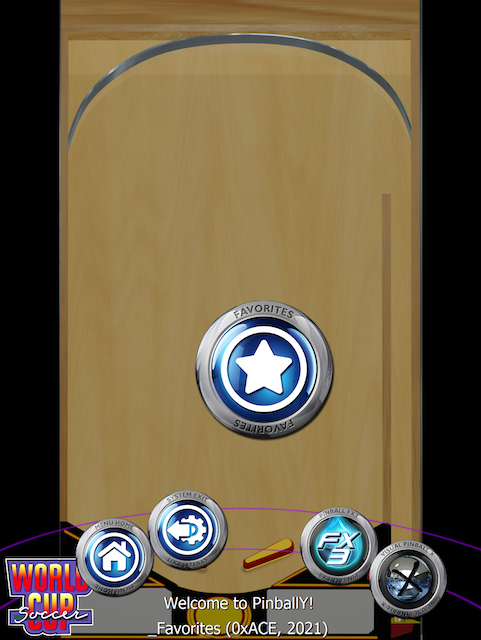

# PinballY Wheel Actions

Enables calling PinballY functions from Wheel Icons (similar to [Pinup Popper](https://www.nailbuster.com/wikipinup/doku.php?id=start)).



Based on a basic idea presented in the [PinballY User Community](https://www.facebook.com/groups/781499215682063/?multi_permalinks=1065515423947106&notif_id=1614013597614579&notif_t=feedback_reaction_generic&ref=notif). See [concept.md](concept.md) for more details of the original idea.

**This is a proof of concept.** If you are here looking for a completed, working,
drop-in solution, please move on. It's not there yet.

## Key Features

* Any PinballY function can be triggered from a Wheel item
* Can trigger anything that can be written in JavaScript
* Wheel items can be included on any wheel (using metafilters)
* You can add your own JavaScript functions to add anything you can code.

Some Examples:
    * Filter Sections; Categories, Favorites, Visual Pinball Y...
    * Exit PinballY
    * Terminate and Shut down the system
    * Open Options
    * Make all your dreams come true

## Setup

To get the basic system setup and working.

1. Backup your system. This is development code, not production ready. Don't blame me if something gets wacked on you. You were warned.

2. Extract the included files into your `PinballY` directory. This should include; `Scripts\wheel-actions.js`, `Scripts\wheel-actions`, `Media\Wheel Actions`, and `Databases\Wheel Actions`.

3. Update your `main.js` to activate Wheel Actions:

```
// Wheel Actions
import 'wheel-actions.js'
```

4. Configure a new "Wheel Actions" system in PinballY. 
    1. Create a new system in "Options", as if you were adding a new Pinball System. The name **must be "Wheel Actions"** as it's hardcoded in the code at the moment.
    2. Set the `Table Path` to your `...\PinballY\Scripts\wheel-actions` directory.
    3. Set the `Default Extension` to `.js`

5. Restart PinballY and enjoy.

## Details Programmers Will Want to Know, e.g. The Big Idea

To get PinballY to display a wheel icon, we create a system named "Wheel Actions" and associated "tables" in the appropriate table directory. These fake tables contain JavaScript code that we can then load and execute within PinballY's JavaScript engine. All the rest is patching things up so PinballY displays them how and where we want them to show up.

* There's a *metafilter* to include the Wheel Actions on every wheel. This is done using a [Widening Filter](http://mjrnet.org/pinscape/downloads/PinballY/Help/MetaFilters.html).

* The actions are named with a leading underscore (`_`) so they get sorted to the start/end of the regular wheel and stay together. If you are using icons for all your tables and actions, you rarely ever see the name.

* Each action's JavaScript file exports a single `doAction()` function that will be called when the action is selected. NOTE: JavaScript side effect code will be run the first time the action is chosen and the JavaScript code is loaded. Side Effects are typically bad things.

## What's Where

The project consists of the following directories and files:

* Scripts -- includes `wheel-actions.js` and the directory `wheel-actions` where the JavaScript for each *action* will be programmed. There are some samples there now.

* Databases -- includes a stub database for the `Wheel Actions` system. You could easily rebuild this yourself, I've just pre-configured the sample actions.

* Media -- includes a stub `Wheel Actions\Wheel Images` directory to give the menu items some graphical flare. (Used some Pinup Popper images here). Again, the sample actions have icons for them.

## Adding New Actions

To add a new action;

1. Create a new JavaScript file in the Wheel Actions table directory, `PinballY\Scripts\wheel-actions`. Give it the same (similar) name that you want it to show up as on your wheels.

2. In that JavaScript file, create a single exported `doAction()` function. Here's a starter:

```
export function doAction() {
    message('I'm a man of action!');
}
```

3. Start PinballY and *configure* the new action. Show Unconfigured, Edit Game Details, make sure you give it a manufacturer and year. Optional: change the title to start with an underscore `_` so all actions will appear together at the start/end of each wheel.

4. Drag and drop your icon/image for the Action.

5. "Click it, click it real good."
